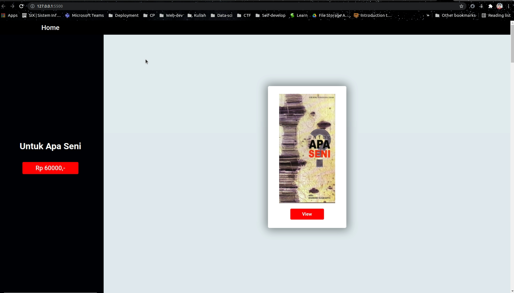
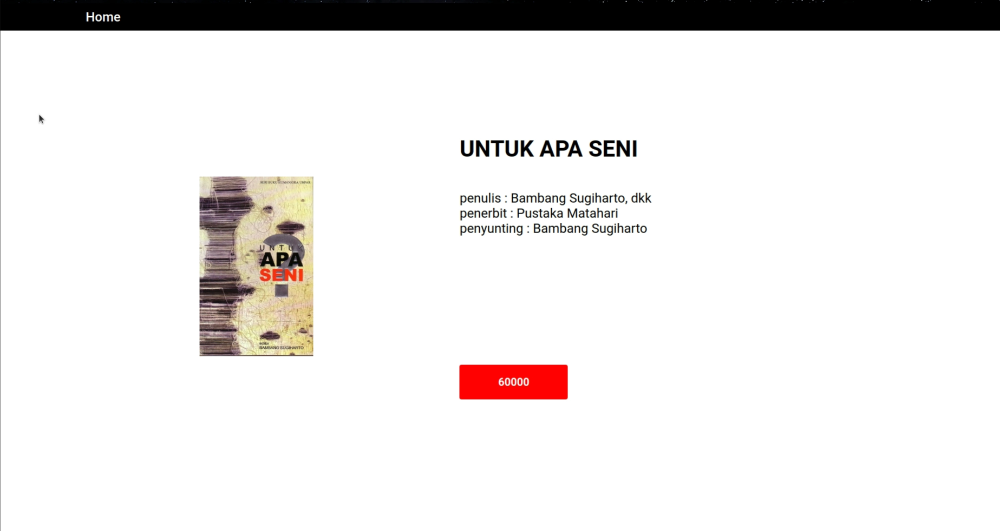
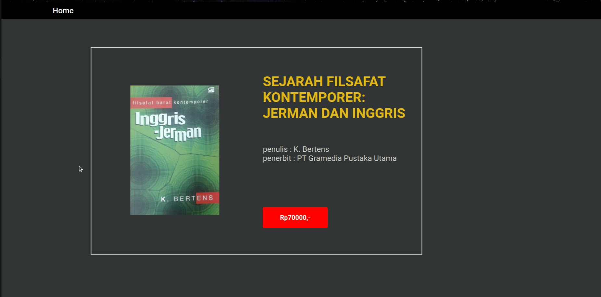

# Algeo02-19079
# Project Name
> Tugas 1 WBD 2021

## General info
Project ini sebuah aplikasi dengan HTML, CSS dan JS sederhana yang berisi : 
* Sebuah halaman yang berisi daftar produk barang yang menampilkan nama, harga, dan thumbnail produk.
* Jika sebuah produk pada halaman daftar produk diklik, muncul halaman kedua yang berisii nama, harga, foto dan deskripsi produk

## Screenshots

Potongan gambar halaman utama

Potongan gambar detail pertama

Potongan gambar detail kedua

****
## Setup
Alternatif 1
- Double klik file html 

Alternatif 2
- Install live server pada visual studio code, lalu klik kanan pada file html dan pilih open with live server.