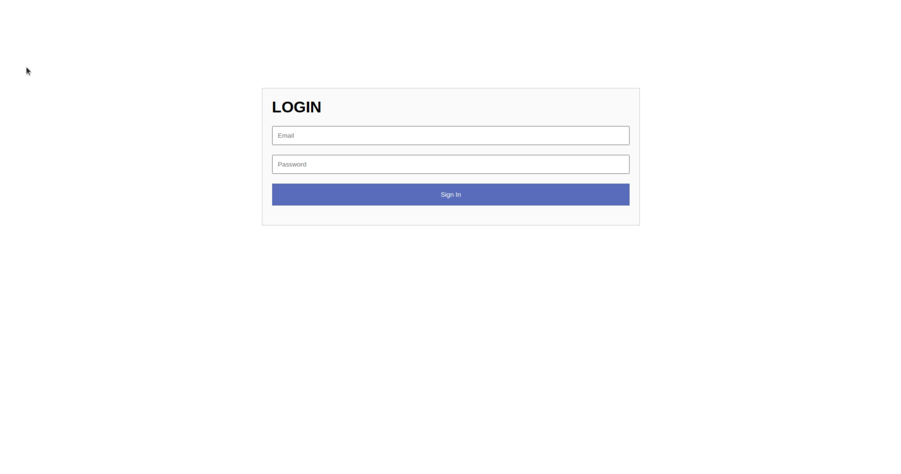
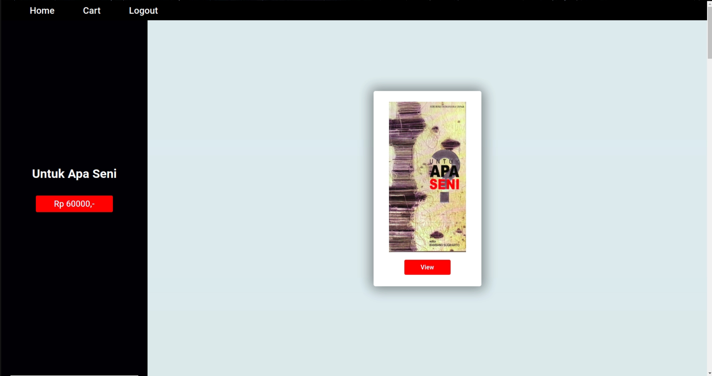
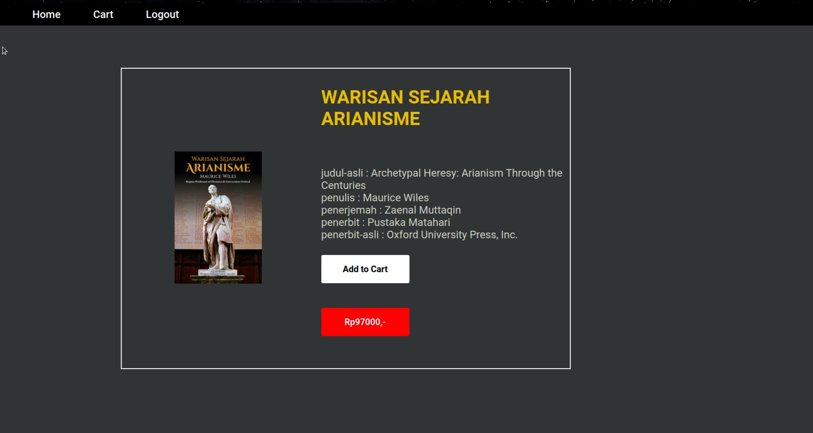
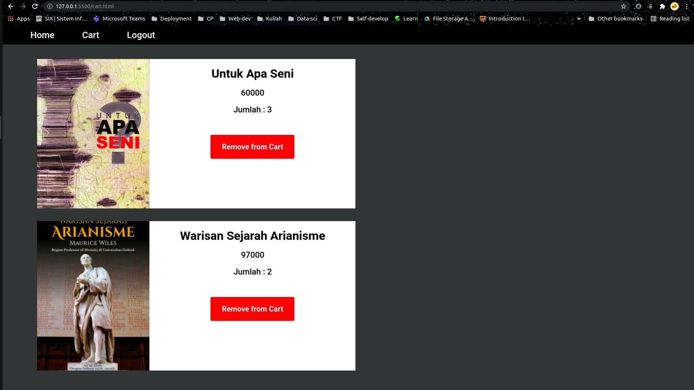

# IF 3110
# Project Name
> Tugas 1 WBD 2021

## Reminder
Jika backend tidak dinyalakan, frontend akan berwarna putih 

****

## Requirements 
- HTML
- CSS
- Javascript
- PHP

****
  
## Setup
### Frontend
- Install live server pada visual studio code, Open folder project ini pada VScode (W01-StaticWeb bukan parentnya) lalu klik kanan pada file html dan pilih open with live server.'
  
### Backend
- Untuk backend cukup install PHP, lalu nyalakan backend dengan cd server, ketik command php -S localhost:9000 index.php.

****
## Screenshots

Potongan gambar halaman login

Potongan gambar halaman utama

Potongan gambar halaman detail

Potongan gambar halaman cart

